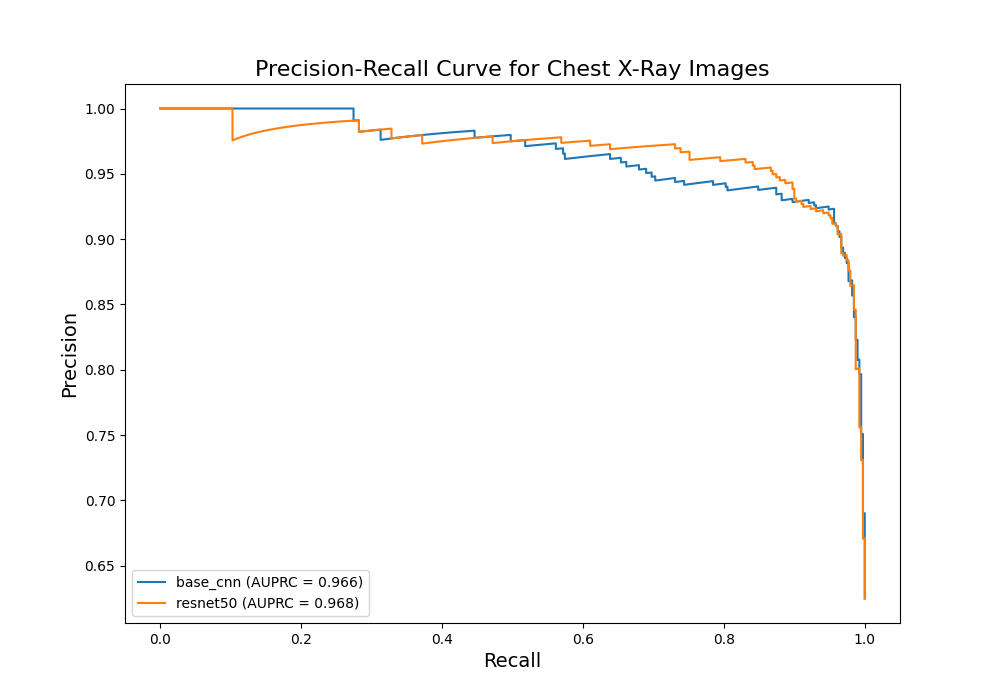
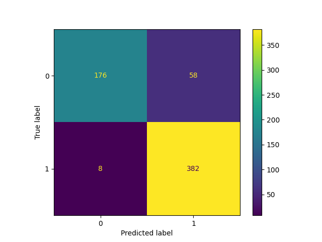
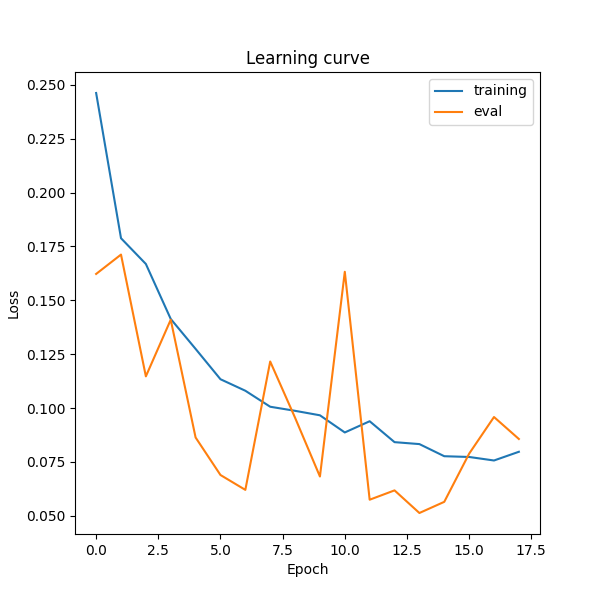
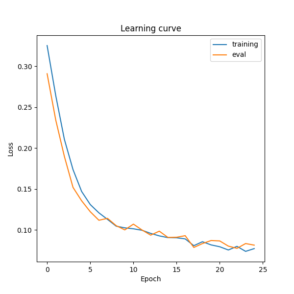

# Pneumonia Detection from Chest X-Ray Images

This project's goal is to detect pneumonia from chest X-ray images. It uses deep learning models to classify images as 
either 'NORMAL' or 'PNEUMONIA'. One of the models is a CNN built using the labs from the Coursera course Convolutional Neural Networks.
The other is the well-known ResNet50 model, applied with transfer learning.

### Table of Contents

* [Introduction](#introduction)
* [Features](#features)
* [Project Structure](#project-structure)
* [Getting Started](#getting-started)
* [Usage](#usage)
* [Configuration](#configuration)
* [Model Performance](#model-performance)

### Introduction

Pneumonia is an infection that inflames the air sacs in one or both lungs. This project leverages computer vision and deep
learning to build a model that can assist in this diagnostic process, by analyzing chest X-ray images.

### Features

#### Exploratory Data Analysis

The EDA, found in the `notebooks` directory revealed several key insights:
* Class imbalance: The dataset is imbalanced, with significant more "PNEUMONIA" than "NORMAL" images
* Image size variability: the original images come in various shapes and sizes, necessitating a resizing preprocess step
* Pixel intensity distribution: "PNEUMONIA" images tend to have a higher concentration of pixels in the brighter range, 
which aligns with the radiological finding of white spots (infiltrates) in the lungs of pneumonia patients

The `data_processing.py` script handles the following preprocessing steps:
* Image resizing: all images are resized to a uniform dimension of 256 by 256 pixels
* Data augmentation: to address the class imbalance, the training data is augmented with random rotations, shifts, shears and zooms
* Normalization: Pixel values are scaled to a range between 0 and 1

### Project Structure

The project is organized as follows:
```
.
├── README.md
├── config
│   ├── base_config.yaml
│   ├── cnn.yaml
│   └── resnet50.yaml
├── data
│   ├── processed
│   └── raw
├── models
│   ├── cnn.keras
│   └── resnet50.keras
├── notebooks
│   └── 01_Exploratory_Data_Analysis.ipynb
├── requirements.txt
└── src
    ├── data_processing.py
    ├── evaluate.py
    ├── model.py
    ├── train.py
    └── util.py
```

* `config` contains YAML files for configuring the models and data paths
* `data` where the raw and processed data is stored
* `models` where the trained models are stored
* `notebooks` contains Jupyter Notebook for EDA
* `src` python source code for data processing, training and evaluation
* `requirements.txt` required packages for this project

## Getting Started

In order to get this up and running please do the following:

#### Pre-requisites:

* Python 3.x
* pip

#### Pre-requisites:

1. Clone the repo
    `https://github.com/RaresPopa22/ChestXRayImages`
2. Install Python packages
    `pip install -r requirements.txt`
3. Download the dataset
    Download the dataset 'Chest X-Ray Images (Pneumonia)' from [Kaggle](https://www.kaggle.com/datasets/paultimothymooney/chest-xray-pneumonia)


#### Usage

Because of their large size, the pre-trained models were not pushed upstream. To train and evaluate their performance, please follow these steps:

#### Training the Models

In order to train a model, run the `train.py` script with the desired configuration:

* Train base CNN model: 
    `python -m src.train --config config/base_cnn.yaml`
* Train CNN model: 
    `python -m src.train --config config/cnn.yaml`
* Train ResNet50 model:
    `python -m src.train --config config/resnet50.yaml`


#### Evaluating the models

After training, you can evaluate and compare the models using the evaluate.py script:
    `python -m src.evaluate --models models/cnn.keras models/resnet50.keras models/base_cnn.keras`

This will print a classification report for each model, a comparison summary, and will plot a Precision-Recall curve plot.

### Configuration

This project uses YAML files for configuration, making it easy to manage model parameters and data paths.

* `base_config.yaml` contains the base configuration, including data paths
* `cnn.yaml`, `resnet50.yaml` and `base_cnn.yaml` contains model-specific parameters

### Model Performance

The models were evaluated on a held-out test set. The main metrics used for comparison are the Area Under the Precision-Recall
Curve (AUPRC), ROC AUC and F1-Score

The table below summarizes the performance of the trained models:


| Model    | AUPRC  | ROC AUC | Recall (Pneumonia) | Precision (Pneumonia) | F1-Score (Pneumonia) |
|----------|--------|---------|--------------------|-----------------------|----------------------|
| resnet50 | 0.968 | 0.958  | 0.98               | 0.91                  | 0.92                 |
| base_cnn | 0.966   | 0.953  | 0.98               | 0.86                  | 0.92                 |

Here are the detailed classification reports:

#### CNN
```
INFO:__main__:Using optimal threshold=0.37587299942970276
INFO:__main__:Classification report for base_cnn
INFO:__main__:
              precision    recall  f1-score   support

      NORMAL       0.96      0.75      0.84       234
   PNEUMONIA       0.87      0.98      0.92       390

    accuracy                           0.89       624
   macro avg       0.91      0.87      0.88       624
weighted avg       0.90      0.89      0.89       624
```

#### ResNet50

```
INFO:__main__:Using optimal threshold=0.23028059303760529
INFO:__main__:Classification report for resnet50
INFO:__main__:
              precision    recall  f1-score   support

      NORMAL       0.96      0.74      0.84       234
   PNEUMONIA       0.86      0.98      0.92       390

    accuracy                           0.89       624
   macro avg       0.91      0.86      0.88       624
weighted avg       0.90      0.89      0.89       624
```
#### BASE CNN
```
Best F1-Score: 0.7879 found at threshold: 0.99
Printing the report for base_cnn
              precision    recall  f1-score   support

      NORMAL       1.00      0.10      0.19       234
   PNEUMONIA       0.65      1.00      0.79       390

    accuracy                           0.66       624
   macro avg       0.82      0.55      0.49       624
weighted avg       0.78      0.66      0.56       624
```
And the final report:
```
   AUPRC  ROC AUC  F1-Score (PNEUMONIA)
0.878324 0.880769              0.925153
0.884185 0.881197              0.913486
0.650000 0.551282              0.787879
```

Both models perform well, with the resnet50 model having a slight edge in the AUPRC, but base_cnn having a slight better precision. The high precision and recall scores indicate that the models are effective at distinguishing between normal and pneumonia X-rays. This also points to
the fact that we don't need a deep neural network here, as the real constraint is the dataset, for training we have around 5k images. Training
a simple model from scratch proved to be very close to a top notch fined tuned model like resnet50.



Having in mind that we are on the eval subject, here are the confusion matrices for both models. Based on this I would say BaseCNN wins by a
whisker, recalling one extra Pneumonia case, which real world, it means more than just a number. Also BaseCNN has a better precision for the
positive case.

#### Base_CNN


#### Resnet50


In the end of this chapter, I will like to present here the learning curves for both models. You can see that resnet50 had already very good initial weights, as its
learning curve is smoother for both training and eval. On the other hand for the base_cnn we have a jumpy learning curve for eval, and this
is because of the very small eval set that we used here, around 1k images.

#### Base_CNN


#### Resnet50


### Grad-Cam

Let's take a look at why our two models made a particular decision, or at least try to guess. We'll do that using the heatmap
that highlights the regions that were the most important in the prediction.

We ran 10 examples, 5 positive, patient had pneumonia, and 5 negative, normal lungs. Anyone is invited to draw their own conclusions but here is what I made of this little experiment:

#### BASE CNN
- on pneumonia cases, it focuses on the left side of the patient, in the lower left lung area
- on 1.png it highlights the shoulder area, which is not clinically meaningful at all, the model
may pick up on non important medical stuff
- on normal cases, it highlights the abdomen area, it might have learned if a bright central structure exists, then the patient has clear lungs
- it shows how fragile the model heuristics are

#### RESNET50
- on normal cases it shows almost no activation, which is a very good principle
- on pneumonia cases, it has an erratic hotspot pattern, it even focuses on the armpit areas in some examples
- it also misclassified 0.png, in there we can see it looks at the edges of the image

I think BaseCNN once again shows a better predictive behavior overall, being more consistently confident. But at the end of the day neither model is reliably looking at the right thing every time.

