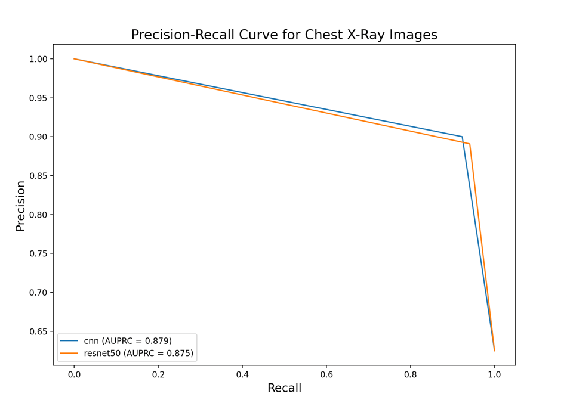

# Pneumonia Detection from Chest X-Ray Images

This project's goal is to detect pneumonia from chest X-ray images. It uses deep learning models to classify images as 
either 'NORMAL' or 'PNEUMONIA'. One of the models is a CNN built using the labs from the Coursera course Convolutional Neural Networks.
The other is the well-known ResNet50 model, applied with transfer learning.

### Table of Contents

* [Introduction](#introduction)
* [Features](#features)
* [Project Structure](#project-structure)
* [Getting Started](#getting-started)
* [Usage](#usage)
* [Configuration](#configuration)
* [Model Performance](#model-performance)

### Introduction

Pneumonia is an infection that inflames the air sacs in one or both lungs. This project leverages computer vision and deep
learning to build a model that can assist in this diagnostic process, by analyzing chest X-ray images.

### Features

#### Exploratory Data Analysis

The EDA, found in the `notebooks` directory revealed several key insights:
* Class imbalance: The dataset is imbalanced, with significant more "PNEUMONIA" than "NORMAL" images
* Image size variability: the original images come in various shapes and sizes, necessitating a resizing preprocess step
* Pixel intensity distribution: "PNEUMONIA" images tend to have a higher concentration of pixels in the brighter range, 
which aligns with the radiological finding of white spots (infiltrates) in the lungs of pneumonia patients

The `data_processing.py` script handles the following preprocessing steps:
* Image resizing: all images are resized to a uniform dimension of 256 by 256 pixels
* Data augmentation: to address the class imbalance, the training data is augmented with random rotations, shifts, shears and zooms
* Normalization: Pixel values are scaled to a range between 0 and 1

### Project Structure

The project is organized as follows:
```
.
├── README.md
├── config
│   ├── base_config.yaml
│   ├── cnn.yaml
│   └── resnet50.yaml
├── data
│   ├── processed
│   └── raw
├── models
│   ├── cnn.keras
│   └── resnet50.keras
├── notebooks
│   └── 01_Exploratory_Data_Analysis.ipynb
├── requirements.txt
└── src
    ├── data_processing.py
    ├── evaluate.py
    ├── model.py
    ├── train.py
    └── util.py
```

* `config` contains YAML files for configuring the models and data paths
* `data` where the raw and processed data is stored
* `models` where the trained models are stored
* `notebooks` contains Jupyter Notebook for EDA
* `src` python source code for data processing, training and evaluation
* `requirements.txt` required packages for this project

## Getting Started

In order to get this up and running please do the following:

#### Pre-requisites:

* Python 3.x
* pip

#### Pre-requisites:

1. Clone the repo
    `https://github.com/RaresPopa22/ChestXRayImages`
2. Install Python packages
    `pip install -r requirements.txt`
3. Download the dataset
    Download the dataset 'Chest X-Ray Images (Pneumonia)' from [Kaggle](https://www.kaggle.com/datasets/paultimothymooney/chest-xray-pneumonia)


#### Usage

Because of their large size, the pre-trained models were not pushed upstream. To train and evaluate their performance, please follow these steps:

#### Training the Models

In order to train a model, run the `train.py` script with the desired configuration:

* Train CNN model: 
    `python -m src.train --config config/cnn.yaml`
* Train ResNet50 model:
    `python -m src.train --config config/resnet50.yaml`


#### Evaluating the models

After training, you can evaluate and compare the models using the evaluate.py script:
    `python -m src.evaluate --models models/cnn.keras models/resnet50.keras --config config/cnn.yaml`

This will print a classification report for each model, a comparison summary, and will plot a Precision-Recall curve plot.

### Configuration

This project uses YAML files for configuration, making it easy to manage model parameters and data paths.

* `base_config.yaml` contains the base configuration, including data paths
* `cnn.yaml`, `resnet50.yaml` contains model-specific parameters

### Model Performance

The models were evaluated on a held-out test set. The main metrics used for comparison are the Area Under the Precision-Recall
Curve (AUPRC), ROC AUC and F1-Score

The table below summarizes the performance of the trained models:


| Model    | AUPRC  | ROC AUC | Recall (Pneumonia) | Precision (Pneumonia) | F1-Score (Pneumonia) |
|----------|--------|---------|--------------------|------------------|------------------|
| cnn      | 0.8788 | 0.8761  | 0.92               | 0.90 |  0.91 |
| resnet50 | 0.8751 | 0.8744  | 0.94               | 0.89 |  0.92 |

Here are the detailed classification reports:

#### CNN
```
Best F1-Score: 0.9114 found at threshold: 0.95
Printing the report for cnn
              precision    recall  f1-score   support

      NORMAL       0.87      0.83      0.85       234
   PNEUMONIA       0.90      0.92      0.91       390

    accuracy                           0.89       624
   macro avg       0.88      0.88      0.88       624
weighted avg       0.89      0.89      0.89       624
```

#### ResNet50

```
Best F1-Score: 0.9152 found at threshold: 0.78
Printing the report for resnet50
              precision    recall  f1-score   support

      NORMAL       0.89      0.81      0.85       234
   PNEUMONIA       0.89      0.94      0.92       390

    accuracy                           0.89       624
   macro avg       0.89      0.87      0.88       624
weighted avg       0.89      0.89      0.89       624
```

Both models perform well, with the ResNet50 model having a slight edge in the F1-Score for the 'Pneumonia' class. The high
precision and recall scores indicate that the models are effective at distinguishing between normal and pneumonia X-rays.

I will end this section with the Precision-Recall curve for both models:

